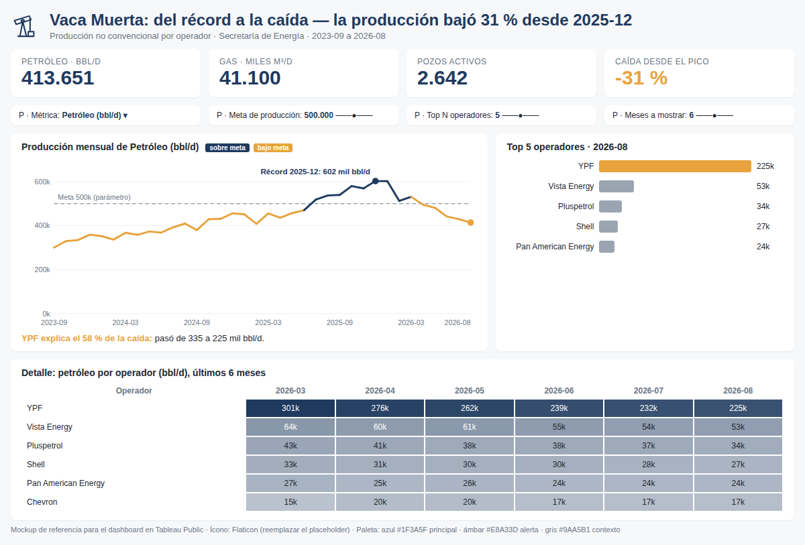

# 📊 Pre-entrega 4 · Diseño y Comunicación (Tableau Public)

Dashboard prototipo de la **producción no convencional de Vaca Muerta** (datos oficiales de la Secretaría
de Energía, sep-2023 a ago-2026) construido en Tableau Public siguiendo el mockup:
**KPIs arriba → hallazgo en el centro → detalle abajo**.



## Archivos

| Archivo | Qué es |
|---|---|
| `data/vaca_muerta_operadores_mensual.csv` | Fuente para Tableau: 396 filas (36 meses × 11 operadores). Columnas: `Mes`, `Operador`, `Petroleo_bbl_d`, `Gas_miles_m3_d`, `Pozos_activos` |
| `construir_csv.py` | Regenera el CSV desde `../vaca-muerta-ops-intelligence/web/datos.json` |
| `mockup.png` / `mockup.html` | Referencia visual del layout objetivo, con los datos reales (se regenera con `armar_mockup.py`) |

## La historia (storytelling)

| Bloque | Pregunta | Mensaje |
|---|---|---|
| **Contexto** (arriba) | ¿De qué se trata? | Vaca Muerta produce **413.651 bbl/d** de petróleo y **41.100 mil m³/d** de gas (ago-2026) |
| **Hallazgo** (centro) | ¿Qué llama la atención? | Tras el récord de **602 mil bbl/d en dic-2025**, la producción cayó **31 % en 8 meses** |
| **Detalle** (abajo) | ¿Dónde está la explicación? | **YPF explica el 58 %** de la caída (−110 mil de −188 mil bbl/d) |

Título del dashboard: **"Vaca Muerta: del récord a la caída — la producción bajó 31 % desde dic-2025"**
(el mensaje principal va primero).

## Paleta (3 colores con rol fijo)

| Rol | Color | Uso |
|---|---|---|
| Principal | `#1F3A5F` azul petróleo | Series de petróleo, barras, títulos |
| Alerta / hallazgo | `#E8A33D` ámbar | Lo que tiene que llamar la atención: pico, caída, operador destacado, "bajo la meta" |
| Contexto | `#9AA5B1` gris | Resto de operadores, líneas de referencia, texto secundario |

Fondo `#F7F8FA`, tarjetas `#FFFFFF`. **Si en el módulo anterior definiste otra paleta, reemplazá estos
tres hex por los tuyos manteniendo los mismos roles.**

En Tableau: *Formato → Libro de trabajo* para la fuente, y en cada Marca → Color → Editar colores
cargás los hex. Para reutilizarla, podés agregarla a `Mis repositorios de Tableau/Preferences.tps`:

```xml
<color-palette name="Vaca Muerta" type="regular">
  <color>#1F3A5F</color><color>#E8A33D</color><color>#9AA5B1</color>
</color-palette>
```

---

## Paso a paso en Tableau Public

### 1. Conexión
*Conectar → Archivo de texto →* `vaca_muerta_operadores_mensual.csv`. Verificá tipos:
`Mes` = Fecha, `Operador` = Cadena, el resto = Número (decimal).

### 2. Parámetros (4, todos conectados a algo visible)

| Parámetro | Tipo | Valores | Se conecta a |
|---|---|---|---|
| **P · Métrica** | Cadena, lista | `Petróleo (bbl/d)`, `Gas (miles m³/d)` | Campo calculado `Métrica seleccionada` → gráfico central y barras |
| **P · Top N operadores** | Entero, rango 3–10, paso 1, actual 5 | | Filtro Top N de `Operador` en el ranking |
| **P · Meta de producción** | Flotante, rango 300.000–650.000, paso 25.000, actual 500.000 | | Línea de referencia + campo `Estado vs meta` (color) en el gráfico central |
| **P · Meses a mostrar** *(opcional)* | Entero, rango 6–36, actual 12 | | Campo `Filtro últimos N meses` en la tabla de detalle |

Clic derecho en cada parámetro → **Mostrar parámetro** para que aparezca en el dashboard.

### 3. Campos calculados

```
// Métrica seleccionada
CASE [P · Métrica]
  WHEN "Petróleo (bbl/d)" THEN [Petroleo_bbl_d]
  WHEN "Gas (miles m³/d)" THEN [Gas_miles_m3_d]
END
```

```
// Último mes
{ FIXED : MAX([Mes]) }
```

```
// Petróleo último mes
IF [Mes] = [Último mes] THEN [Petroleo_bbl_d] END
```

```
// Gas último mes
IF [Mes] = [Último mes] THEN [Gas_miles_m3_d] END
```

```
// Pozos activos último mes
IF [Mes] = [Último mes] THEN [Pozos_activos] END
```

```
// Petróleo pico
{ FIXED [Mes] : SUM([Petroleo_bbl_d]) }
```
*(y el KPI "Caída desde el pico" = `SUM([Petróleo último mes]) / MAX([Petróleo pico]) - 1`, formato %)*

```
// Estado vs meta  (se usa en Color del gráfico central)
IF SUM([Petroleo_bbl_d]) >= [P · Meta de producción] THEN "Sobre la meta" ELSE "Bajo la meta" END
```

```
// Filtro últimos N meses
DATEDIFF('month', [Mes], [Último mes]) < [P · Meses a mostrar]
```

```
// Título dinámico del gráfico central
"Producción mensual de " + [P · Métrica]
```

### 4. Hojas

| # | Hoja | Construcción | Colores |
|---|---|---|---|
| 1 | **KPI Petróleo** | `SUM([Petróleo último mes])` en Texto. Tipo de marca Texto, fuente 28 pt | Azul |
| 2 | **KPI Gas** | `SUM([Gas último mes])` en Texto | Azul |
| 3 | **KPI Pozos activos** | `SUM([Pozos activos último mes])` en Texto | Azul |
| 4 | **KPI Caída desde el pico** | Campo de caída, formato `0 %` | **Ámbar** (es el hallazgo) |
| 5 | **Evolución mensual** (hallazgo) | Columnas: `MES(Mes)` continuo · Filas: `SUM([Métrica seleccionada])` · Marca Línea + `Estado vs meta` en Color · Línea de referencia = `P · Meta de producción` · Anotación en dic-2025: *"Récord: 602 mil bbl/d"* | Sobre meta azul, bajo meta ámbar, referencia gris punteada |
| 6 | **Ranking de operadores** | Filas: `Operador` · Columnas: `SUM([Métrica seleccionada])` · Filtro `Operador` → pestaña *Superior* → *Por campo: Superior [P · Top N operadores] por SUM(Métrica seleccionada)* · Filtro `Mes` = último mes · Orden descendente | YPF ámbar, resto gris (Color = `[Operador] = "YPF"`) |
| 7 | **Detalle por operador** | Tabla de resaltado: Filas `Operador`, Columnas `MES(Mes)` discreto, Color y Texto `SUM([Petroleo_bbl_d])` · Filtro `Filtro últimos N meses` = Verdadero | Secuencial gris → azul |

### 5. Dashboard (layout del mockup)

Tamaño **fijo 1200 × 900** (Tableau Public lo muestra bien en web). Todo en contenedores:

```
┌──────────────────────────────────────────────────────────────────────┐
│ [ícono] TÍTULO con el mensaje principal            subtítulo/fuente │  ← Contexto
├──────────────┬──────────────┬──────────────┬─────────────────────────┤
│ KPI Petróleo │ KPI Gas      │ KPI Pozos    │ KPI Caída desde pico    │  ← Contexto (KPIs)
├──────────────┴──────────────┴──────────────┴─────────────────────────┤
│ Parámetros: [Métrica ▼] [Meta ——o——] [Top N ——o——] [Meses ——o——]    │
├──────────────────────────────────────────┬───────────────────────────┤
│ Evolución mensual + línea de meta        │ Ranking Top N operadores  │  ← Hallazgo
│ (anotación del récord dic-2025)          │                           │
├──────────────────────────────────────────┴───────────────────────────┤
│ Detalle: operador × mes (últimos N meses)                            │  ← Detalle
└──────────────────────────────────────────────────────────────────────┘
```

- Contenedor vertical principal con 4 horizontales dentro (header, KPIs, gráficos, detalle).
- Relleno exterior 8 px, fondo de cada hoja blanco sobre fondo `#F7F8FA` del dashboard.
- Ocultá títulos de hoja de los KPIs y poné la etiqueta encima en gris (`Petróleo · bbl/d`, etc.).
- Agregá un objeto **Texto** debajo del gráfico central con el insight en una línea:
  *"YPF explica el 58 % de la caída: pasó de 335 a 225 mil bbl/d."*

### 6. Ícono de Flaticon

1. En [flaticon.com](https://www.flaticon.com) buscá **"oil pump"** o **"pumpjack"**, filtrá por estilo
   **Lineal / Monocolor** (un solo estilo para todo el dashboard).
2. Descargá en **PNG 128 px** (el PNG de Flaticon ya viene con fondo transparente). Si podés, elegí el
   color `#1F3A5F` con el editor de Flaticon antes de bajarlo.
3. En el dashboard: arrastrá un objeto **Imagen** al lado del título → elegí el archivo → *Ajustar imagen*
   y *Centrar*.
4. Opcional, mismo estilo: íconos chicos al lado de cada KPI (gota = petróleo, llama = gas, torre = pozos).
5. Poné la atribución en el pie: *"Íconos: Flaticon"* (la licencia gratuita lo pide).

### 7. Publicar
*Archivo → Guardar en Tableau Public* → nombre **"Pre-entrega 4 · Vaca Muerta · Lleyton Murphy"**.
En tu perfil de Tableau Public, en la configuración del libro, verificá que **esté visible** (no oculto) y
abrí el link en una ventana de **incógnito** antes de entregarlo.

---

## Checklist de la consigna

- [ ] ≥ 3 visualizaciones con jerarquía → 4 KPIs + evolución + ranking + detalle
- [ ] ≥ 2 parámetros funcionales → Métrica (campo calculado), Top N (filtro), Meta (referencia + color), Meses (filtro calculado)
- [ ] Narrativa legible → título con el mensaje, contexto arriba, hallazgo en el centro, detalle abajo
- [ ] Paleta definida, mismo color para el mismo rol → azul principal, ámbar alerta, gris contexto
- [ ] ≥ 1 ícono de Flaticon, fondo transparente, un solo estilo
- [ ] Link público verificado en incógnito
