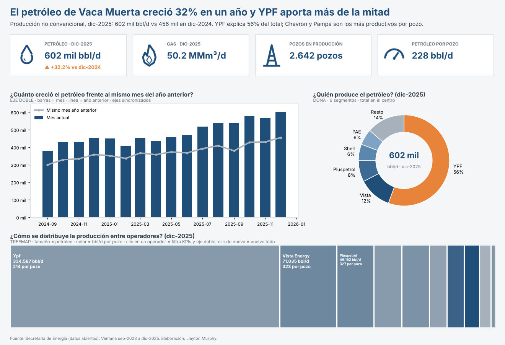

# 🛢️ Pre-entrega 5 · Gráficos avanzados y dashboard en Tableau (Vaca Muerta)

**🔗 Dashboard publicado en Tableau Public:** https://public.tableau.com/app/profile/lleyton.murphy/viz/VacaMuertaPreentrega5/DashboardVacaMuerta

Dashboard de Tableau sobre la **producción oficial de petróleo y gas no convencional de Vaca Muerta**
(Secretaría de Energía): KPIs, **eje doble con ejes sincronizados**, **dona** (6 segmentos con el total en
el centro), **treemap** de distribución y una **acción de filtro con reseteo**.

> Dataset propio, no Supertienda: sale de [`vaca-muerta-ops-intelligence`](../vaca-muerta-ops-intelligence)
> (datos abiertos de la Secretaría de Energía, procesados por el pipeline de
> [`vaca-muerta-analytics`](../vaca-muerta-analytics)).

## ▶ Empezá acá

**[`GUIA_PASO_A_PASO.md`](GUIA_PASO_A_PASO.md)** + **[`data/VacaMuerta_Tableau.xlsx`](data/VacaMuerta_Tableau.xlsx)**:
armado click a click en ~30 min, funciona en **cualquier versión** de Tableau Public.
Así tiene que quedar: [`img/referencia_dashboard.png`](img/referencia_dashboard.png).



| Archivo | Qué es |
|---|---|
| [`data/VacaMuerta_Tableau.xlsx`](data/VacaMuerta_Tableau.xlsx) | Dataset listo para Tableau: mes × operador, con el grupo de la dona y la marca de último mes ya calculados. |
| [`GUIA_PASO_A_PASO.md`](GUIA_PASO_A_PASO.md) | Guía click a click (conectar → hojas → dashboard → acción → publicar). |
| [`img/`](img) | Los 4 íconos de los KPIs y la imagen de referencia. |
| `tableau/*.twbx` | Libro generado automáticamente. **Solo abre en Tableau 2026.1/2026.2**; en otras versiones tira `D2E8DA72`, por eso el camino recomendado es la guía. |
| `scripts/` | `construir_csv.py`, `construir_excel.py`, `generar_iconos.py`, `generar_referencia.py`, `generar_twb.py`. |

---|---|
| [`tableau/VacaMuerta_Dashboard_Murphy_Lleyton.twbx`](tableau/VacaMuerta_Dashboard_Murphy_Lleyton.twbx) | **Libro empaquetado** (datos + íconos adentro). Es lo que abrís y publicás. |
| [`tableau/VacaMuerta_Dashboard_Murphy_Lleyton.twb`](tableau/VacaMuerta_Dashboard_Murphy_Lleyton.twb) | El mismo libro en XML, para revisar en Git. |
| [`data/vaca_muerta_operadores_mensual.csv`](data/vaca_muerta_operadores_mensual.csv) | Dataset: 280 filas, mes × operador (sep-2023 a dic-2025). |
| [`img/`](img) | Los 4 íconos de los KPIs (mismo estilo de línea, color primario). |
| `scripts/` | `construir_csv.py` arma el CSV, `generar_iconos.py` los íconos y `generar_twb.py` el libro. |

---

## 1 · Mensaje macro (lo que se entiende en 5 segundos)

> **"El petróleo de Vaca Muerta creció 32% en un año y YPF aporta más de la mitad."**

- dic-2025: **602 mil bbl/d** contra 456 mil en dic-2024 (**+32,2%**).
- **YPF: 55,6%** del petróleo. Le siguen Vista (11,8%), Pluspetrol (7,7%), Shell y PAE (5,7% cada una).
- Productividad: **Pampa (677 bbl/d por pozo)** y **Chevron (548)** sacan 2 a 3 veces más petróleo por pozo que YPF (214).

## 2 · Qué hay en el libro

| Hoja | Tipo | Pregunta que responde |
|---|---|---|
| `KPI Petróleo`, `KPI Gas`, `KPI Pozos`, `KPI Productividad` | Texto (tarjetas con ícono) | ¿Cuánto se produce hoy y cuánto cambió? |
| `Eje doble · Petróleo vs año anterior` | **Eje doble**: barras (mes actual) + línea (mismo mes del año anterior), **ejes sincronizados** | ¿Cuánto creció el petróleo frente al mismo mes del año anterior? |
| `Dona · Participación por operador` | **Dona**: torta en eje doble con un círculo blanco encima; 6 segmentos, total en el centro | ¿Quién produce el petróleo? |
| `Treemap · Operadores` | **Treemap** (distribución): tamaño = petróleo, color = productividad por pozo | ¿Cómo se reparte la producción y quién es más productivo? |
| **`Dashboard Vaca Muerta`** | Dashboard 1200 × 820, todo en contenedores | Junta todo: titular → KPIs → macro → detalle |

**Campos calculados** (todos usados en alguna hoja):

| Campo | Fórmula | Dónde se usa |
|---|---|---|
| Petróleo último mes (bbl/d) | `IF [Mes] = {FIXED : MAX([Mes])} THEN [Petroleo_bbl_d] END` | Dona, Treemap, KPIs |
| Petróleo mismo mes año anterior | `IF [Mes] = {FIXED : MAX([Mes])} THEN [Petroleo_bbl_d_anio_anterior] END` | KPI de variación |
| Gas / Pozos activos último mes | ídem, con `[Gas_Mm3_d]` y `[Pozos_activos]` | KPIs |
| Var % interanual petróleo | `(SUM(último) - SUM(año anterior)) / SUM(año anterior)` | KPI Petróleo |
| Productividad (bbl/d por pozo) | `SUM([Petróleo último mes]) / SUM([Pozos activos último mes])` | Treemap (color), KPI |
| Participación % petróleo | `SUM([Petróleo último mes]) / MIN({FIXED : SUM([Petróleo último mes])})` | Dona (etiqueta) |
| Grupo operador (dona) | `CASE` con el top 5 + `'Resto'`: así la dona queda en **6 segmentos** | Dona (color) |
| Tiene comparación interanual | `NOT ISNULL([Petroleo_bbl_d_anio_anterior])` | Filtro del eje doble (meses con año anterior) |
| Dona base / Dona hueco | `MIN(0)` | Las dos tortas de la dona |
| KPI … (texto) | `STR(...)` con unidades y flecha ▲/▼ | Tarjetas KPI |

## 3 · Layout, identidad e interactividad

```
┌──────────────────────────────────────────────────────────────────────┐
│ TITULAR QUE CONCLUYE (arriba-izquierda, más grande)                   │
│ "El petróleo de Vaca Muerta creció 32% en un año y YPF aporta…"       │
├──────────────┬──────────────┬──────────────┬─────────────────────────┤
│ 💧 602 mil   │ 🔥 50,2 MMm³ │ 🏗 2642 pozos │ ⏲ 228 bbl/d por pozo    │  ← KPIs
│ ▲ +32,2%     │              │              │                         │
├──────────────┴──────────────┴─────┬────────┴─────────────────────────┤
│ EJE DOBLE (macro)                 │ DONA (concentración)             │  ← centro
│ barras = mes · línea = año ant.   │ 6 segmentos · 602 mil al centro  │
├───────────────────────────────────┴──────────────────────────────────┤
│ TREEMAP por operador (detalle) → clic = filtra KPIs y eje doble      │  ← abajo
└──────────────────────────────────────────────────────────────────────┘
```

- **Contenedores**: un contenedor vertical con todo adentro; los KPIs van en un contenedor horizontal con
  4 tarjetas (cada tarjeta es otro contenedor horizontal: ícono + hoja). Nada flota.
- **Paleta (3 colores con rol)**:
  - Azul `#1F4E79`: medida principal (petróleo actual, números de los KPIs).
  - Naranja `#E8833A`: foco/acento (YPF en la dona, la variación ▲).
  - Gris `#A6B1BB`: contexto/comparación (año anterior, "Resto").
  - Los demás operadores de la dona usan tintes del azul, es decir, el mismo rol.
- **Íconos**: 4 PNG de línea (gota, llama, torre, velocímetro), mismo trazo y color.
- **Acción de filtro** `Filtrar tablero por operador`:
  - Origen: **Treemap**. Destino: **KPIs + Eje doble** (la dona queda fuera a propósito, porque filtrada a un solo operador daría 100%).
  - Se ejecuta al seleccionar. Al limpiar la selección: **mostrar todos los valores** (ese es el reseteo).
  - No hay filtros rápidos de operador, así que la acción no repite ningún filtro lateral.

---

## 4 · Cómo publicarlo (≈10 minutos)

1. Instalá o actualizá **Tableau Public Desktop** (gratis): <https://public.tableau.com/app/discover/download>.
   El libro está en formato **2026.1**, así que necesitás Tableau Public **2026.1 o posterior**.
2. Abrí `tableau/VacaMuerta_Dashboard_Murphy_Lleyton.twbx` (doble clic).
   - Si te pide ubicar el archivo de datos, elegí `data/vaca_muerta_operadores_mensual.csv`.
3. Andá a la pestaña **Dashboard Vaca Muerta** y compará con los **valores de control** (abajo).
4. Probá la acción: clic en **YPF** en el treemap. Los KPIs tienen que cambiar a 335 mil bbl/d y ▲ +35,2%,
   y el eje doble tiene que mostrar solo YPF. Volvé a hacer clic en YPF (o clic en un espacio vacío) y todo
   vuelve al total.
5. **Archivo → Guardar en Tableau Public como…** → iniciá sesión → nombre: `Vaca Muerta · Dashboard (Pre-entrega 5)`.
6. En la página que se abre: ⚙️ → asegurate de que el libro sea **visible** (no oculto).
7. Copiá el link (`https://public.tableau.com/app/profile/<tu-usuario>/viz/...`) y abrilo en una **ventana de
   incógnito**. Tiene que abrir sin login.
8. Pegá ese link en la entrega.

> Si cambiás algo, volvé a hacer **Guardar en Tableau Public**. El link sigue siendo el mismo y apunta a la
> versión nueva.

### Valores de control (lo que tenés que ver)

| Elemento | Valor esperado |
|---|---|
| KPI Petróleo | **602 mil bbl/d** · ▲ +32.2% vs dic-2024 |
| KPI Gas | **50.2 MMm³/d** |
| KPI Pozos | **2642 pozos** |
| KPI Productividad | **228 bbl/d** por pozo |
| Dona | YPF 56% · Resto 14% · Vista 12% · Pluspetrol 8% · Shell 6% · PAE 6%; centro: **602 mil bbl/d** |
| Eje doble | 16 meses (sep-2024 → dic-2025); dic-2025: barra 601.990 vs línea 455.502 |
| Treemap | 10 rectángulos; el más grande es YPF (334.587); el más oscuro es Pampa (677 bbl/d por pozo) |

### Si al abrirlo sale el error `D2E8DA72` ("missing required attribute…", "worksheet-number")

Significa que **tu Tableau es anterior a 2026.1**: el libro usa el formato 2026.1 y las versiones
anteriores lo validan contra su esquema viejo y lo rechazan (no es que el archivo esté roto).

1. Fijate tu versión en **Ayuda → Acerca de Tableau Public**.
2. Si es 2025.x o anterior: desinstalala, bajá la última de
   <https://public.tableau.com/app/discover/download> (2026.1 o posterior) y volvé a abrir el `.twbx`.
3. Si no podés actualizar, usá el **Plan B** de la sección 6 (armarlo a mano con el CSV, ~40 minutos).

### Si algo se ve distinto (ajustes de 1 minuto)

- **El hueco de la dona es muy chico o muy grande**: en la hoja Dona, tarjeta *Marcas* → pestaña
  `Dona hueco` → *Tamaño*. Achicá el círculo blanco hasta que quede un anillo.
- **Etiquetas de la dona encimadas**: *Marcas* → `Dona base` → *Etiqueta* → "Permitir que las etiquetas se superpongan" desmarcado.
- **Ejes del eje doble**: clic derecho en el eje derecho → *Sincronizar eje* tiene que estar ✔ (ya viene
  así) y el eje derecho oculto.

---

## 5 · Checklist contra la rúbrica

| Criterio (peso) | Cómo se cumple |
|---|---|
| Eje doble (20%) | Barras + línea de **la misma medida** (petróleo vs. año anterior) con **ejes sincronizados**. Así se evita el error de alturas engañosas. |
| Dona + distribución (15%) | Dona de **6 segmentos** con el total en el centro, más un **treemap** por operador. |
| Composición y jerarquía (20%) | Titular → KPIs → macro (eje doble + dona) → detalle (treemap). Todo en **contenedores**. |
| Interactividad (25%) | **Acción de filtro** con origen Treemap, destino KPIs + eje doble y **reseteo** ("mostrar todos los valores" al deseleccionar). |
| Identidad + título (15%) | 3 colores con rol, 4 íconos del mismo estilo y un **título que concluye** ("creció 32%… YPF aporta más de la mitad"). |
| Publicación (5%) | Link de Tableau Public probado en incógnito (paso 4). |

---

## 6 · Plan B: armarlo a mano en Tableau (si el .twbx no abre en tu versión)

Conectá `data/vaca_muerta_operadores_mensual.csv` (*Archivo de texto*) y creá los campos calculados de la
tabla de la sección 2 (*Análisis → Crear campo calculado*). Después:

1. **Eje doble**: `MES(Mes)` continuo en Columnas. En Filas, `SUM(Petroleo_bbl_d)` y
   `SUM(Petroleo_bbl_d_anio_anterior)`. En Filtros, `Tiene comparación interanual` = Verdadero. Clic
   derecho en la 2.ª medida → *Eje doble* → clic derecho en el eje derecho → **Sincronizar eje** → ocultarlo.
   Marcas: la primera en *Barra* azul y la segunda en *Línea* gris.
2. **Dona**: en Filas, `Dona base` y `Dona hueco`, ambas tipo *Circular (pie)*. En `Dona base` va
   `Grupo operador (dona)` en Color, `Petróleo último mes` en Ángulo y `Grupo` + `Participación %` en
   Etiqueta. En `Dona hueco`: color blanco, tamaño más chico y `KPI petróleo (texto)` en Etiqueta. Después
   *Eje doble*, sincronizar y ocultar los encabezados.
3. **Treemap**: `Operador` en Etiqueta, `Petróleo último mes` en Tamaño y `Productividad` en Color
   (gris → azul).
4. **KPIs**: una hoja por KPI, con el campo `KPI … (texto)` en Texto y el ícono a la izquierda (objeto
   *Imagen* del dashboard, en `img/`).
5. **Dashboard** (1200 × 820, fijo): un contenedor vertical con estas partes:
   - el titular (objeto *Texto*);
   - un contenedor horizontal con los 4 KPIs;
   - un contenedor horizontal con el eje doble y la dona;
   - el treemap;
   - la fuente.
6. **Acción**: *Dashboard → Acciones → Agregar acción → Filtrar*. Origen: Treemap, al **Seleccionar**.
   Destino: KPIs + Eje doble. **Al borrar la selección: Mostrar todos los valores**.

---

## Texto para la entrega

> **Pre-entrega 5 · Lleyton Murphy**. Dashboard publicado en Tableau Public: `<link>`.
> Dataset propio: producción oficial de petróleo y gas no convencional de Vaca Muerta (Secretaría de
> Energía), mes × operador, sep-2023 a dic-2025.
> **Mensaje**: el petróleo creció 32% interanual (602 mil bbl/d en dic-2025) y YPF aporta 56%.
> Incluye eje doble con ejes sincronizados (petróleo vs. mismo mes del año anterior), dona de 6 segmentos
> con el total al centro, treemap por operador (tamaño = producción, color = productividad por pozo) y una
> acción de filtro desde el treemap hacia los KPIs y el eje doble, con reseteo al deseleccionar.

## Notas sobre los datos

- La ventana termina en **dic-2025** a propósito. En el dataset, desde ene-2026 no figuran pozos nuevos
  (0 durante 8 meses), así que la producción de 2026 solo muestra la declinación de los pozos existentes y
  marcaría una caída que no es real.
- "OTRAS (resto)" agrupa a los operadores chicos tal como vienen del pipeline de origen. PHOENIX GLOBAL
  no tiene producción en la ventana y quedó afuera.
- Para regenerar todo:

  ```bash
  python3 scripts/construir_csv.py
  python3 scripts/generar_iconos.py   # necesita Pillow
  python3 scripts/generar_twb.py      # opcional: --xsd ruta/al/twb_2026.1.0.xsd
  ```
